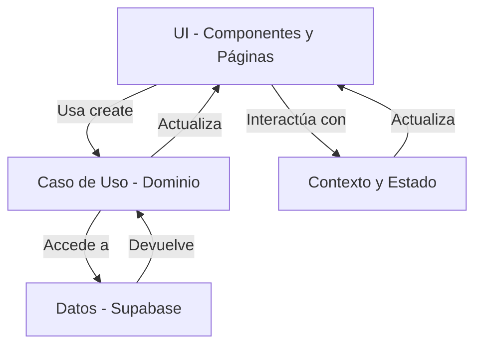

# PreparaULM - Arquitectura del Proyecto

## Introducción

La arquitectura de PreparaULM está diseñada para ser modular, escalable y mantenible, siguiendo las mejores prácticas de desarrollo web moderno. Utilizamos NextJS como framework principal, lo que nos permite tener una estructura de aplicación basada en componentes y páginas, con soporte para renderizado del lado del servidor y del cliente.

## Capas de la Arquitectura

### 1. **Capa de Presentación (UI)**

- **Componentes**: Utilizamos componentes de React definidos en `src/components` y `src/components/ui`, siguiendo las convenciones de Shadcn para una interfaz de usuario consistente y moderna.
- **Estilos**: Implementamos Tailwind CSS para un diseño responsive y estilizado, con animaciones y transiciones definidas en `globals.css`.
- **Páginas**: Las páginas de la aplicación están en `src/app`, donde cada archivo representa una ruta específica.

### 2. **Capa de Lógica de Negocio (Dominio)**

- **Casos de Uso**: Los casos de uso del dominio se llaman directamente desde la aplicación o componentes mediante un método estático `create`, al que se le inyectan las dependencias. Actualmente, la única dependencia es Supabase, y se debe inyectar `@/utils/supabase/client.ts` para componentes del lado del cliente (no SSR) o `@/utils/supabase/server.ts` para componentes con renderizado del lado del servidor (SSR). Esto asegura que la lógica de negocio sea independiente de la implementación específica de la base de datos y permite una mayor flexibilidad y testabilidad.
  Cada caso de uso ha de ser independiente.
  Los casos de uso siempre tendrán 2 interficies, una para {NombreCasoUso}UseCaseParams y {NombreCasoUso}UseCaseResult.
  La capa de dominio no tiene test unitarios.

### 3. **Capa de Datos (Infraestructura)**

- **Supabase**: Utilizamos Supabase como backend para la gestión de datos. Los clientes de Supabase están definidos en `@/utils/supabase/client` para componentes del lado del cliente y `@/utils/supabase/server` para operaciones del lado del servidor.
- **Autenticación**: La autenticación está gestionada mediante un contexto personalizado (`AuthProvider`), con modales para login, registro y recuperación de contraseña.

### 4. **Capa de Contexto y Estado**

- **Proveedores de Contexto**: Utilizamos contextos como `AuthModalProvider` y `ToastProvider` para manejar el estado global y la UI interactiva como notificaciones.

## Comunicación entre Capas

La comunicación entre capas es unidireccional en su mayoría para mantener la separación de preocupaciones:

- La capa de presentación interactúa con la lógica de negocio mediante la llamada directa a casos de uso del dominio usando el método estático `create` con la inyección de dependencias adecuada.
- La lógica de negocio se comunica con la capa de datos para obtener o modificar información en Supabase a través de las dependencias inyectadas.
- Los datos fluyen de vuelta a la UI a través de los componentes y contextos, actualizando la interfaz según sea necesario.

## Diagrama de Arquitectura

## Tecnologías Utilizadas

- **NextJS**: Framework para renderizado de React con soporte SSR y CSR.
- **Tailwind CSS**: Para estilos y diseño responsive.
- **Shadcn**: Componentes de UI reutilizables y personalizados.
- **Supabase**: Backend como servicio para base de datos y autenticación.
- **Datadog**: Para monitoreo y seguimiento de vistas con `DatadogRumProvider` y `DatadogViewTracker`.

## Repositories Extendidos (Task 015)

Como parte de la refactorización de queries en `GenerateTestUseCase`, se han extendido los siguientes repositories con nuevos métodos:

### TestRepository
- `getUserAnsweredQuestionIds(userId: string): Promise<Set<number>>`: Obtiene IDs de preguntas ya respondidas por el usuario
- `getCandidateQuestions(categoryIds: string[], excludeQuestionIds: Set<number>, includeAnswered: boolean): Promise<Question[]>`: Busca preguntas candidatas con filtros
- `saveTestQuestions(testExecutionId: number, questions: SelectedQuestionInternal[]): Promise<void>`: Guarda preguntas de un test
- `createTestExecution(testId: number | null, userId: string, categoryId?: string): Promise<TestExecution>`: Crea ejecución de test (ajustado para soportar test_id null)

### CategoryRepository
- `getPrioritizedSubcategories(userId: string, baseCategoryId: string): Promise<PrioritizedSubcategory[]>`: Obtiene subcategorías priorizadas por progreso del usuario

### UserCategoryPerformanceRepository
- `getUserCategorySuccessRate(userId: string, categoryId: string): Promise<number>`: Obtiene tasa de éxito de una categoría específica
- `getUserAverageSuccessRate(userId: string): Promise<number>`: Calcula tasa de éxito promedio del usuario

Estos métodos encapsulan las queries que anteriormente estaban directamente en `GenerateTestUseCase`, mejorando la separación de responsabilidades y la testabilidad.

## Convenciones

## Nombres de Archivos\*\*:

- Hooks y utilidades en camelCase,
- carpetas en kebab-case,
- componentes en PascalCase.
- **Iconos**: Siempre encapsulados en componentes wrapper en `/src/components/ui/icons/`.

Esta arquitectura asegura que PreparaULM sea un proyecto bien estructurado, fácil de mantener y preparado para escalar según las necesidades del negocio.
