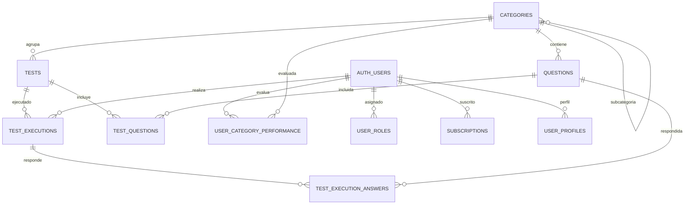

# AeroTest - Esquema de Base de Datos

## Introducción
La base de datos de AeroTest está diseñada para soportar la gestión de datos de pruebas aéreas, utilizando Supabase como plataforma de backend. El esquema completo de la base de datos se encuentra en `db/schema.sql`, y este documento proporciona un resumen de las principales tablas y sus relaciones.

## Estructura de la Base de Datos

### Tablas Principales
- **categories**: Almacena las categorías de preguntas, con campos como `id`, `name`, `description`, `icon_name`, `color`, y `parent_category_id` para categorías anidadas.
- **questions**: Contiene las preguntas para los tests, con campos como `id`, `category_id`, `text`, `options` (en formato JSONB), `correct_answer`, `explanation`, y `difficulty`.
- **tests**: Registra los tests disponibles, con campos como `id`, `title`, `category_id` (puede ser NULL para tests mezclados), `created_at`, y `duration_seconds`.
- **test_executions**: Almacena las ejecuciones de tests por usuario, con campos como `id`, `test_id`, `user_id`, `created_at`, `completed_at`, y `score`.
- **test_questions**: Tabla de relación entre tests y preguntas, definiendo el orden de las preguntas en cada test con campos `test_id`, `question_id`, y `order_num`.
- **test_execution_answers**: Registra las respuestas dadas por los usuarios en cada ejecución de test, con campos como `id`, `test_execution_id`, `question_id`, `selected_answer`, `is_correct`, `observations`, y `is_marked`.
- **user_category_performance**: Rastrea el rendimiento de los usuarios por categoría, con campos como `id`, `user_id`, `category_id`, `success_rate`, `last_test_date`, y `tests_completed`.
- **user_roles**: Define los roles de los usuarios, con campos como `id`, `user_id`, `role`, y `created_at`.
- **subscriptions**: Gestiona las suscripciones de los usuarios, con campos como `id`, `user_id`, `plan_id`, `status`, `current_period_start`, `current_period_end`, `cancel_at_period_end`, `created_at`, y `updated_at`.
- **user_profiles**: Almacena información de perfil de los usuarios, con campos como `user_id`, `name`, `phone`, `avatar_url`, `role`, `created_at`, y `updated_at`.

### Relaciones
- Cada pregunta pertenece a una categoría (`questions.category_id` referencia `categories.id`).
- Las categorías pueden tener subcategorías mediante `parent_category_id`.
- Un test puede estar asociado a una categoría específica o ser mixto (`tests.category_id` puede ser NULL).
- Las ejecuciones de test están vinculadas a un test y a un usuario (`test_executions.test_id` y `user_id`).
- Las respuestas de una ejecución están vinculadas a una ejecución de test y a una pregunta específica (`test_execution_answers.test_execution_id` y `question_id`).
- El rendimiento por categoría está vinculado a un usuario y una categoría (`user_category_performance.user_id` y `category_id`).
- Los roles, suscripciones y perfiles están vinculados a usuarios específicos mediante `user_id`.

## Diagrama de Relaciones

## Notas
- La base de datos utiliza las capacidades de Supabase para autenticación y almacenamiento, lo que simplifica la gestión de usuarios y la seguridad. Las tablas hacen referencia a `auth.users` para vincular datos con usuarios autenticados.
- Row Level Security (RLS) está habilitado en varias tablas como `test_executions`, `test_execution_answers`, `user_category_performance`, `user_roles`, `subscriptions`, y `user_profiles` para restringir el acceso a datos según el usuario autenticado.
- Para más detalles sobre las columnas específicas, tipos de datos y políticas de seguridad, consulte el archivo `db/schema.sql`.

Este esquema asegura que los datos de AeroTest estén bien organizados y sean fácilmente accesibles para las operaciones de la aplicación, manteniendo la seguridad y la integridad de los datos. 