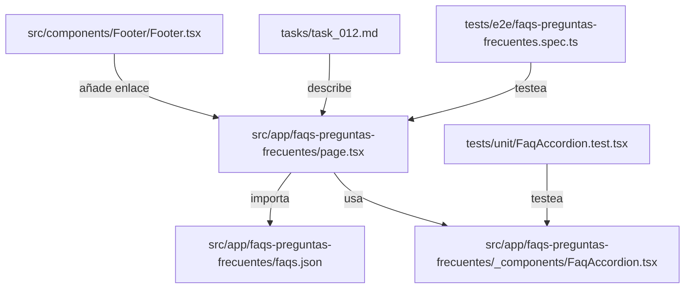

# Task 012: Página de FAQs (Preguntas Frecuentes)

## Objetivo

Crear una página de preguntas frecuentes accesible desde el footer, con acordeón, autocompletar y agrupación por categorías, siguiendo la guía de estilos y buenas prácticas de SEO.

---

## Requisitos

- **Ruta:** `/faqs-preguntas-frecuentes`
- **Enlace:** Footer, junto a enlaces legales.
- **Contenido:** Array de preguntas/respuestas en archivo JSON aparte.
- **Estructura:** Categorías (Funcionamiento, Pagos/Stripe, Cuenta, etc.).
- **UI:** Acordeón de la guía de estilos (`/src/app/styleguide`), con campo de autocompletar para filtrar dudas.
- **SEO:** Implementar schema.org FAQPage.
- **Test:** Unitarios para el componente FAQ y test e2e básico.
- \*\*Sin límite de preguntas por categoría.
- **Acordeón:** Usar el de la guía de estilos, permitiendo abrir varias preguntas a la vez si así lo permite el componente.

---

## Subtareas

1. **Estructura de datos**

   - Crear `src/app/faqs-preguntas-frecuentes/faqs.json` con preguntas agrupadas por categorías.
   - Ejemplo de estructura:
     ```json
     [
       {
         "category": "Pagos",
         "questions": [
           {
             "question": "¿Qué métodos de pago aceptáis?",
             "answer": "Aceptamos pagos con tarjeta de crédito y débito a través de Stripe."
           }
         ]
       }
     ]
     ```

2. **Página y componente**

   - Crear `src/app/faqs-preguntas-frecuentes/page.tsx`.
   - Crear `src/app/faqs-preguntas-frecuentes/_components/FaqAccordion.tsx` reutilizando el acordeón de la guía de estilos.
   - Integrar autocompletar para filtrar preguntas.
   - Importar y mostrar los datos del JSON.

3. **Footer**

   - Modificar el footer global (`src/components/Footer/Footer.tsx`) para añadir el enlace a la nueva página.

4. **SEO**

   - Añadir marcado schema.org FAQPage en la página.

5. **Tests**

   - Unitarios para el componente de acordeón y el autocompletar (`tests/unit/FaqAccordion.test.tsx`).
   - Test e2e básico: comprobar que la página carga, que el acordeón funciona y que el filtro/autocompletar muestra resultados (`tests/e2e/faqs-preguntas-frecuentes.spec.ts`).

6. **Documentación**
   - Documentar la estructura y uso del JSON.

---

## Diagrama de Archivos



---

## Análisis de Impacto

- **Rendimiento:**
  - El uso de JSON estático y acordeón no impacta negativamente. El filtrado por texto se realiza en cliente, sin llamadas extra.
- **SEO:**
  - El marcado FAQPage mejora la indexación y visibilidad en buscadores.
- **Mantenibilidad:**
  - Separar los datos en JSON facilita futuras traducciones o ediciones.
- **UX:**
  - El autocompletar y el acordeón mejoran la experiencia de usuario.

---

## Notas

- Seguir la convención de nombres y estructura de carpetas del proyecto.
- Usar el acordeón de la guía de estilos (`/src/app/styleguide`).
- Las preguntas sobre pagos deben estar orientadas a Stripe.
- El autocompletar debe ser rápido y usable.
- El JSON debe ser fácilmente extensible para futuras categorías o idiomas.
